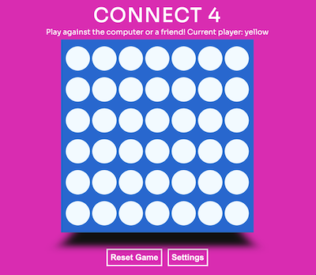
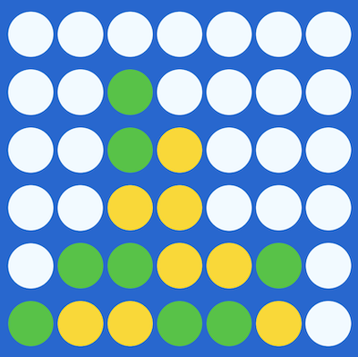
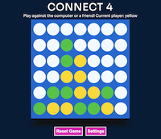
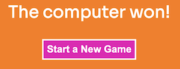
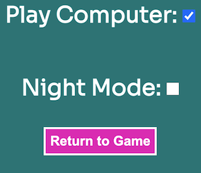
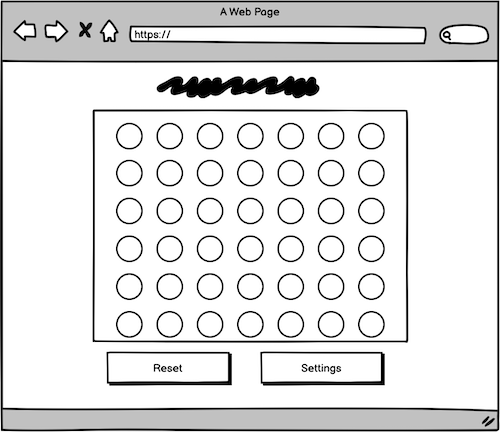
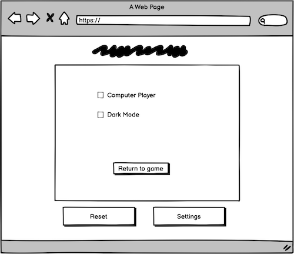
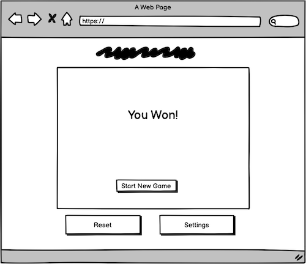

# Connect 4

The site can be viewed [here](https://neil314159.github.io/portfolio-project-2/).
  

## Table of Contents
* [Purpose](#Purpose)
* [Features](#Features)
* [Future Features](#features-to-implement-in-the-future)
* [Wireframes](#wireframes)
* [Technologies Used](#Technologies-Used)
* [Testing](#Testing)
* [Validation Testing](#validation-testing)
* [Deployment](#deployment)
* [Credits](#credits)
* [Acknowledgements](#acknowledgements)

## Features

* Home Screen
    *
    

* Navigation Bar 
    * This provides links to the home page, the resource page and the newsletter signup page, allowing the user to easily navigate their way to each section. This is a clear, simple menu present on every page so the user can be confident in finding their way around the site.

    

* Game Board
    * This board is a digital 
    

* Control Buttons
    * These buttons under the main game board allow the user to reset the game back to it's starting point, or to access the setting menu. The settings menu button will toggle over and back to the setting page if tapped repeatedly.
     

* Player Status
	* This text shows which colour player is currently active.
     

* Computer Player Mode
	* This mode provides a simple computer opponent for the player. Programmed in Javascript, this algorithm looks for patterns of three tokens already on the board, and seeks to disrupt them before them other player can win. It does this by looking at open slots beside any vertical, horizontal or diagonal stretches of three tokens and then places a token in the fourth spot. If there are no such patterns on the board, the computer chooses a column at random.

* 2 Player Mode
    * This mode allows for 2 players using the same device side-by-side to take turns. There are green and yellow tokems which alternate on every turn. 

* Night Mode
    * Turning on night mode darkens the background of the site, making it easier to use at night when on a phone or laptop.
    

* Results Page
    * This page notifies the user who has won the game, for either a two-player or computer opponent game. It also has a button allowing the suer to restart the next game straight away.
    

* Setting Page
    * Here the user can choose to play two-player or computer games. They can also turn on and off dark mode from this page. Clicking the button in the menu will take you back while still maintaining the state of the game.
    

### Features to implement in the future
* Currently the logic used by the computer player is quite simple. It is possible to calculate multiple moves ahead and choose the best option statistically, but this is quite taxing on the browser when done through CSS and Javascript. A different software framework may be required for handling these operations.
* Adding some sound effects and animations to the game would increase the level of interactivity.
* An online multiplayer option could be added to increase user engagement. This would require managing user accounts and networking protocols.

## Wireframes
 
 
 

## Technologies Used

* HTML 
    * HTML was used to define the content and overall structure of the website.
* CSS 
    * CSS was used for styling the site, as well as for defining and manipulating 3D elements needed for the game.
* JavaScript
    * Javascript was used to create the layout and interactive elements of the game. This involved using event listeners to trigger actions, and manipulating the DOM to manage the state of the game.
* [Github](https://github.com) 
    * GitHub is used to store the source code of the site.
* [Git Pages](https://pages.github.com)
    * Git Pages was used to deploy the website.
* [Gitpod](https://gitpod.io) 
    * Gitpod provided a remote development environment and was linked to Github to facilitate storage and deployment.
* [Google Fonts](https://fonts.google.com/)
	* Google Fonts was used to browse a number of options and select the Sora font as being suitable for the project.
* [Balsamiq](https://balsamiq.com/wireframes/)
	* Before starting coding, Balsamiq was used to lay out the site and refine the design.
* [clrs.cc](https://clrs.cc)
    * This site provided a pallette of suitable colours for a modern website which were then adjusted for my project.
* [MacOS Preview](https://support.apple.com/guide/preview/welcome/mac)
    * MacOS Preview was used to generate and edit screenshots of the website.
* [Favicon](https://favicon.io/) 
    * Favicon.io was used to draw, edit and download a favicon ready to deploy to the site.
* [Lighthouse](https://developers.google.com/web/tools/lighthouse#devtools) 
    * Google Lighthouse generated a report which verified the performance and usability of the site. 
* [Google Chrome Developer Tools](https://developers.google.com/web/tools/chrome-devtools) 
    * Chrome Developer Tools were used to debug programming logic errors by logging variables to the console.
* [Wave Web Accessibility Tool](https://wave.webaim.org) 
    * The Wave Tool generated a report which highlighted potential problems for users with accessibilty concerns.

## Testing

* Test how responsive the website is on different browsers and screen sizes.
    * Test:
        1. Select a test suite of browsers (Chrome, Safari, Firefox).

### Validation Testing

* HTML: The site was fully tested using the [W3C Validator](https://validator.w3.org/nu/?doc=https%3A%2F%2Fneil314159.github.io%2Fportfolio-project-2%2F). There were no errors and no warnings.
* The [W3C Jigsaw Validator](jigsaw.w3.org) was used to check the CSS of the website. There were no errors shown.
* Accessibility: the site was checked for accessibility problems using the Google Lighthouse suite in Chrome and the [Wave](https://wave.webaim.org/report#/https://neil314159.github.io/portfolio-project-2/index.html) Repoort Generator. This showed no errors.
* [JSHint](https://jshint.com/) was used to validate the Javascript on the project website. This showed up one warning about declaring a function within a loop that could potentially access a variable outside the scope of the loop. This method of declaration was used in the course material. This is also a commmonly-reported overzealous warning from JSHint, as using let rather than var manages the scope of the loop properly and renders this operation safe.

### Unfixed Bugs

There are no other unfixed bugs at this point.

## Deployment

### Project Set-up
The recommended Code Institute template found [here](https://github.com/Code-Institute-Org/gitpod-full-template) was used. This template was set up with a standard configuration for VSCode and Gitod which saved time and let me get started quickly. I chose a repository name and used Gitpod to create and edit my project files.

The Remote/Guide website was deployed to GitHub Pages by the folllowing actions:
1. Navigate to [Project 2 Portfolio](https://github.com/neil314159/portfolio-project-2) on GitHub.
1. Click on the 'Settings' tab.
1. Select 'Pages' from the menu on the left side of the page. 
1. Select the 'main' branch in the source selector drop-down.
1. Click 'Save'.
1. After a few minutes the website was deployed. The finished project can be found here: https://neil314159.github.io/portfolio-project-2/

## Credits

### Code

This [tutorial](https://3dtransforms.desandro.com/cube) on how to construct and rotate 3D cubes in CSS was used to understand some of the principles used in my project.

### Acknowledgements
Thanks to Daisy McGirr for her advice and guidance on this project.